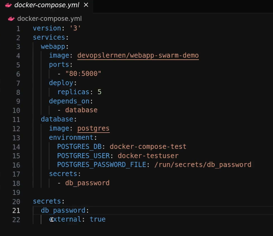
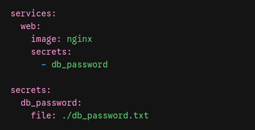
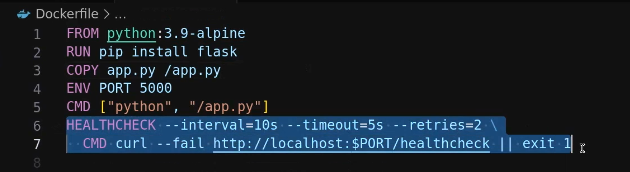

# Docker

## Basics

Start eines Docker images:

    docker run --name nexcloud01 -p 8080:80 -d nextcloud

docker start

docker stop

docker rmi (löschen docker image)

docker rm (löschen docker container)

Attach to a running docker session:

    docker exec -it CONTAINER_NAME /bin/bash

## Volumes

Ein volume anlegen:

    docker volume create VOLUME_NAME

Ein docker containter mit einem eingebundenen volume starten:

    docker run --name NAME_CONTAINER -p8080:80 --mount source=VOLUME_NAME,target=/usr/share/nginix//html -d nginx

Eine Datei in ein Docker volume kopieren:

docker cp FILE VOLUME_NAME:MOUNTPOINT

    docker cp index.html test-volume:/user/share/nginx/html

## docker compose

In das Verzeichnis wechseln in dem das docker compose file liegt.

Einen docker container aufsetzen:

    docker compose up 

## Updates

Docker container können über portainer mittels webhook (z.B. über Ansible) getriggert werden. Dann wird ein Update der Container durchgeführt.

## Secrets

Zunächst muss das secret mit docker secret angelegt werden:

    read -rs PASSWORD && echo "$PASSWORD" | docker secret create db_password -

Im docker compose file muss auf die ressource verwiesen werden:



Alternativ mit einem File und nicht mit docker secret create (docker swarm):



## Docker Swarm

Wenn zur Lastverteilung oder zur Erhöhung der Verfügbarkeit Cluster verwendet werden sollen, kann man hierzu Docker Swarm einsetzen.

## Portainer

Mit Portainer kann man sich eine übersichtliche Oberfläche für die Verwaltung von containern einrichten: https://www.portainer.io

## Restart Optionen

Docker Dokumentation zu den Optionen:

| Flag                       | Description                                                                                                                                                                                                                                                                                                                                                                       |
| -------------------------- | --------------------------------------------------------------------------------------------------------------------------------------------------------------------------------------------------------------------------------------------------------------------------------------------------------------------------------------------------------------------------------- |
| `no`                       | Don't automatically restart the container. (Default)                                                                                                                                                                                                                                                                                                                              |
| `on-failure[:max-retries]` | Restart<br> the container if it exits due to an error, which manifests as a <br>non-zero exit code. Optionally, limit the number of times the Docker <br>daemon attempts to restart the container using the `:max-retries` option. The `on-failure` policy only prompts a restart if the container exits with a failure. It doesn't restart the container if the daemon restarts. |
| `always`                   | Always<br> restart the container if it stops. If it's manually stopped, it's <br>restarted only when Docker daemon restarts or the container itself is <br>manually restarted. (See the second bullet listed in [restart policy details](https://docs.docker.com/engine/containers/start-containers-automatically/#restart-policy-details))                                       |
| `unless-stopped`           | Similar to `always`, except that when the container is stopped (manually or otherwise), it isn't restarted even after Docker daemon restarts.                                                                                                                                                                                                                                     |

Angewendet werden kann das wie folgt:

    docker run -d --restart unless-stopped redis

Diese Optionen können auch im docker compose file angegeben werden:

```
restart: always
```

### Autoheal

Um docker container, die den status unhealty erhalten gibt es das folgende docker container image:

https://hub.docker.com/r/willfarrell/autoheal

Das Docker file selbst muss einen entsprechenden health Status definieren:


