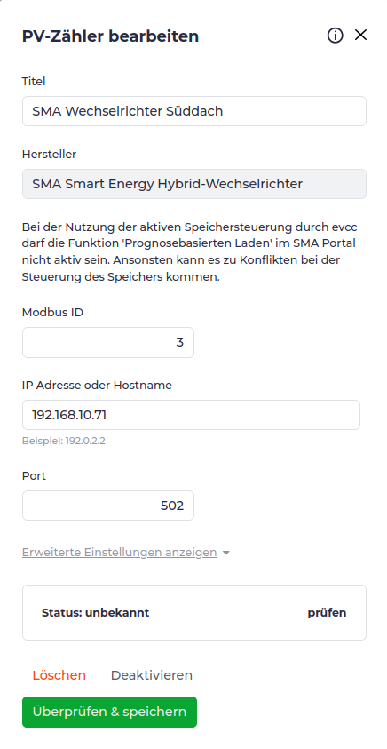
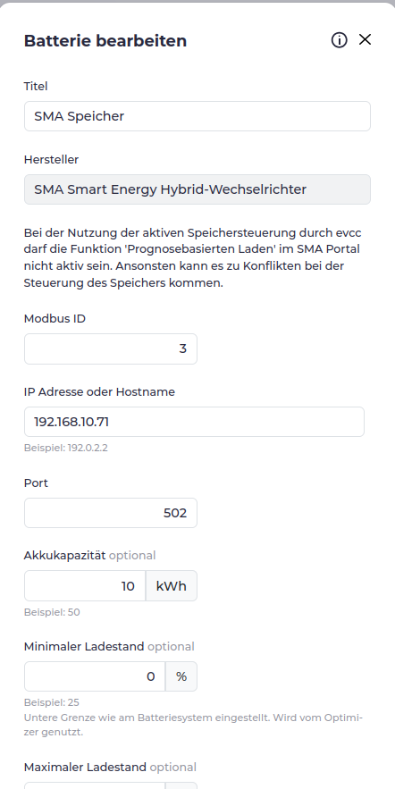

# Home Assistant

Klicke auf die drei Punkte → Repositories
Füge die Repository-URL ein und klicke auf Hinzufügen

https://github.com/evcc-io/hassio-addon


Nun evcc installieren.

## SSH installieren

SSH App installieren

## HTTPS

Schlüssel erzeugen (auf dem PC und auf den raspi kopieren):

    openssl req -sha256 -newkey rsa:4096 -nodes -keyout /ssl/homeassistant.key -x509 -days 3650 -out /ssl/homeassistant.crt

Zertifikat und Key per ssh auf das Target kopieren.

Nach dem Kopieren den ssh Port in der Konfiguration der ssh App wieder zurücksetzen, so dass ein Login nicht mehr möglich ist.

Nun muss das Zertifikat in den Netzwerkeinstellungen eingetragen werden.

## SMA Wechselrichter hinzufügen

Es muss immer der SMA Hybrid wechselrichter in der Liste ausgewählt werden.

Protokoll Modbus TCP auswählen (Port 502 ID 3)

### Batterie hinzufügen

Gleiche Einstellungen wie beim Wechselrichter

### Zähler hinzufügen







### Heizung hinzufügen

Negative Leistung.

Unter /app_configs/49686a9f_evcc/evcc.yaml folgende Datei abspeichern:

```
# 1. Virtuelles Meter zur Leistungssimulation
meters:
  - name: wp_virtuelles_meter
    type: custom
    power:
      source: http
      uri: http://192.168.10.86/rpc/Switch.GetStatus?id=0
      jq: 'if .output == true then 2000 else 0 end'

# 2. Anbindung der Hardware (Standard Shelly Template)
chargers:
  - name: shelly_heizung
    type: template
    template: shelly
    host: 192.168.10.86
    # standbypower entfällt, da das Meter nun die exakte Leistung (0 oder 2000W) liefert

# 3. Steuerungslogik & Schutz vor Takten
loadpoints:
  - title: Tecalor Wärmepumpe
    charger: shelly_heizung
    meter: wp_virtuelles_meter  # Verknüpft das virtuelle Messgerät mit diesem Ladepunkt
    mode: pv
    enable:
      threshold: -2200
      delay: 20m
    disable:
      threshold: 500 
      delay: 30m
```
