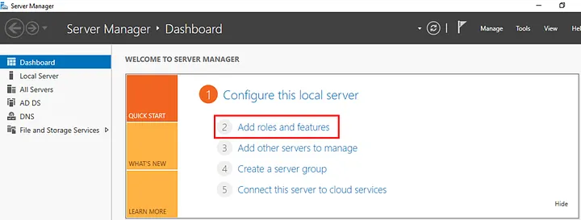
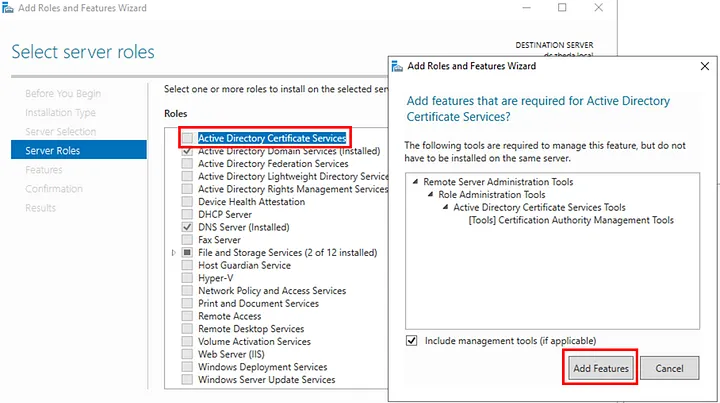
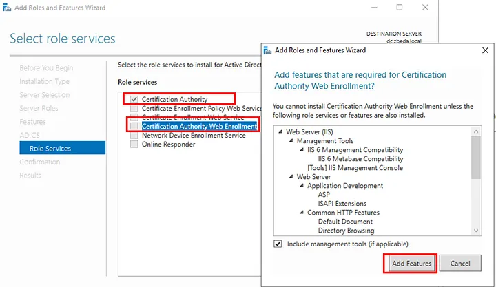
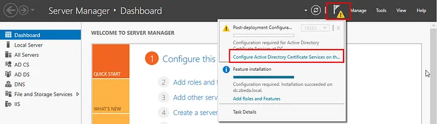
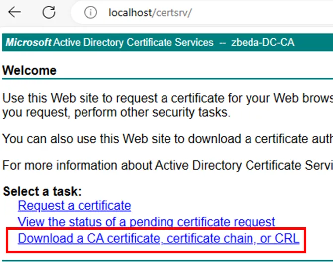
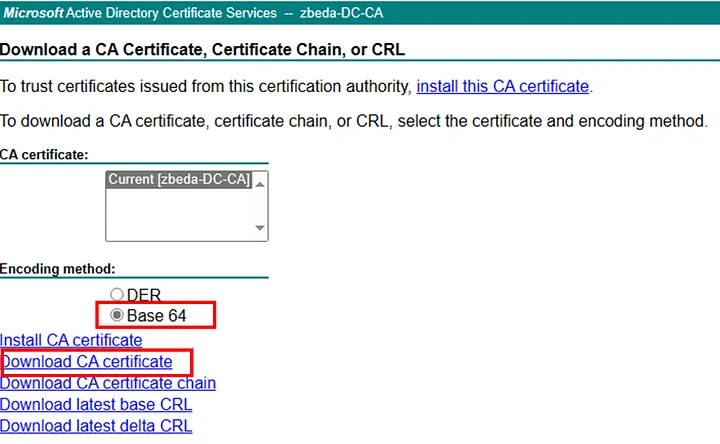
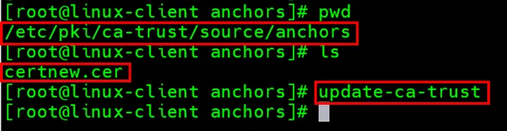

Description on how linux is securely connected to AD:
[https://david-dudu-zbeda.medium.com/how-to-connect-securely-ldaps-your-linux-server-in-windows-active-directory-aeaf41b66c49](https://david-dudu-zbeda.medium.com/how-to-connect-securely-ldaps-your-linux-server-in-windows-active-directory-aeaf41b66c49)

# Install RootCA ,Generate and Import public certificate.
Source of this blog: [https://david-dudu-zbeda.medium.com/install-rootca-generate-and-import-public-certificate-5316beff4af7](https://david-dudu-zbeda.medium.com/install-rootca-generate-and-import-public-certificate-5316beff4af7)
## Introduction

**What is a Root CA?:** A Root CA is a trusted authority that gives out digital certificates to other entities, such as websites. These certificates prove that the entities are who they say they are and that their communication is- secure.

**Why is a Root CA required?:** A Root CA is required to establish trust in online communication. When you visit a website, your browser checks its certificate and makes sure it comes from a trusted Root CA. This way, you can be sure that you are not talking to an impostor or a hacker.

**What does a Root CA do?:** A Root CA does several things, such as:

- **Issuing certificates:** A Root CA issues certificates to other entities, including intermediate CAs and end entities. These certificates contain a public key and information about the entity they belong to.  
- **Validating certificates:** A Root CA validates the identity and security of the entities it issues certificates to. It also protects its own private key from unauthorized use.  
- **Revoking certificates:** A Root CA revokes certificates that are no longer valid, such as if they have been compromised. It keeps lists of revoked certificates and updates them regularly.  
- **Cross-signing certificates:** A Root CA cross-signs certificates from other Root CAs to provide backup and avoid single points of failure.

## Blog objective

In this blog , the objective is to provide a comprehensive guide on how to install a Root Certificate Authority (Root CA) on a Windows Active Directory server. Additionally, I will guide you through the process of creating a public certificate and importing it into a Linux server. This public certificate is essential for any component that communicates with the domain and its services using TLS/SSL.

It’s important to note that in complex environments, you may encounter scenarios where the Root CA is not installed on the Active Directory server. or there may be Intermediate servers that are trusted by the Root CA and publish their own public certificates. Furthermore, digital safes like Hardware Security Modules (HSMs) may be used to securely store private keys.

I believe that this blog post will help you gain a better understanding of the overall procedure.
## Prerequisites and Ingrediencies

    Windows Active Directory server — Domain should be configured.

## Install RootCA role.

Follow these steps to add a Certification Authority to your Active Directory server.

1. Open the Server Manager dashboard and select Add roles and feature.

2. On the next window click Next

3. Select the Roles-based or feature based installation checkbox and proceed by clicking Next

4. Select the Select a server from the server pool — Verify that your domain server hostname is highlighted and proceed by clicking Next

5. Select the Active Directory Certificate Service. After checking this option, a new window will appear, Click on Add Features and Click Next

6. In the next window, leave the default settings unchanged and proceed by clicking *Next*

7.In the next window, leave the default settings unchanged and proceed by clicking *Next*

8. Select the Certification Authority & Certification Authority Web Enrollment checkbox. After checking this option, a new window will appear, Click on Add Features and proceed by clicking Next

9. In the next window, leave the default settings unchanged and proceed by clicking Next

10. In the next window, leave the default settings unchanged and proceed by clicking Next
Get David (Dudu) Zbeda’s stories in your inbox

Join Medium for free to get updates from this writer.

11. In the next window, leave the default settings unchanged and proceed by clicking Next

12. In the next window, leave the default settings unchanged and and proceed by clicking Install.

13. Once the installation is complete, click Close

14. Access the Notification flag (highlighted in yellow) and click on Configure Active Directory Certificate Service.

15. In the next window, leave the default settings unchanged and proceed by clicking Next

16. Select the Certification Authority & Certification Authority Web Enrollment checkbox and proceed by clicking Next

17. Select Enterprise CA and proceed by clicking Next

18. Selec tthe Root CA and proceed by clicking Next

19. Check the Create a new private key and proceed by clicking Next

20. Choose your preferred hash algorithm (For instance, I have selected SHA512.) and proceed by clicking Next

21. In the next window, leave the default settings unchanged and proceed by clicking Next

22. In the next window, leave the default settings unchanged and proceed by clicking Next

23. In the next window, leave the default settings unchanged and proceed by clicking Next

24. In the next window, leave the default settings unchanged and proceed by clicking Configure

25. Click Close

Congratulations, you have now successfully installed the Root CA on your Active Directory server.

## Create public certificate.

These steps outline the process for generating a public certificate. The public certificate is essential for servers and services that require secure communication (TLS/SSL) with domain services, such as Secure LDAP.

1. Login to the Active Directory server
2. Open your web browser and navigate to http://localhost/certsrv
3. Click on Download a CA certificate, certificate chain, or CRL

4. Select Base64 and proceed by clicking Download CA Certificate

5. The root CA’s public certificate will be generated and saved in your download folder with the filename ‘certnew.cer.’”

You now have public certificate that can be used by server require to communicate with the domain using TLS\SSL
## Upload the public certificate to Centos\Redhat Linux server.

These steps explain how Linux server can trust the domain by importing the public certificate.

1. Copy the RootCA public certificate to /etc/pki/ca-trust/source/anchors/ folder in the Linux Client server.
2. Run the command update-ca-trust — This command will add the public certificate the system’s trust store.

Upload RootCA public certificate